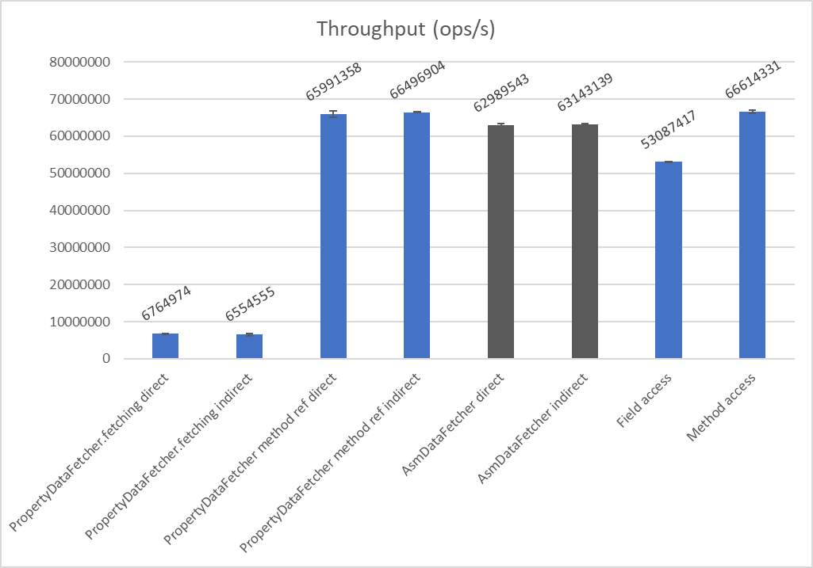

# AsmDataFetcher for GraphQL Java

TODO: Add more text

## Usage

Without fallback to PropertyDataFetcher (does not work for fields, or -currently- records):

```java
RuntimeWiring rtw =
    RuntimeWiring.newRuntimeWiring()
        .codeRegistry(
            GraphQLCodeRegistry.newCodeRegistry()
                .defaultDataFetcher(
                    AsmDataFetcherFactory.createFactory())
                .build())
```

With fallback to PropertyDataFetcher:

```java
RuntimeWiring rtw =
    RuntimeWiring.newRuntimeWiring()
        .codeRegistry(
            GraphQLCodeRegistry.newCodeRegistry()
                .defaultDataFetcher(
                    AsmDataFetcherFactory.createFactory(
                        factoryEnvironment ->
                            PropertyDataFetcher.fetching(
                                factoryEnvironment.getFieldDefinition().getName())))
                .build())
```

## Benchmarks

Preliminary benchmarks:

```
Benchmark                                                                   Mode  Cnt         Score        Error  Units
AsmVsPropertyBenchmark.benchMarkThroughputDirectClassHierarchy             thrpt   15   6764974,315 ±  25020,739  ops/s
AsmVsPropertyBenchmark.benchMarkThroughputDirectClassHierarchyAsm          thrpt   15  62989543,971 ± 370488,977  ops/s
AsmVsPropertyBenchmark.benchMarkThroughputDirectClassHierarchyMethodRef    thrpt   15  65991358,560 ± 785710,214  ops/s
AsmVsPropertyBenchmark.benchMarkThroughputDirectField                      thrpt   15  53087417,650 ± 124443,041  ops/s
AsmVsPropertyBenchmark.benchMarkThroughputDirectMethod                     thrpt   15  66614331,393 ± 386561,339  ops/s
AsmVsPropertyBenchmark.benchMarkThroughputInDirectClassHierarchy           thrpt   15   6554555,139 ± 294484,688  ops/s
AsmVsPropertyBenchmark.benchMarkThroughputInDirectClassHierarchyAsm        thrpt   15  63143139,227 ± 364155,242  ops/s
AsmVsPropertyBenchmark.benchMarkThroughputInDirectClassHierarchyMethodRef  thrpt   15  66496904,206 ± 202976,405  ops/s
```

This is around a 11x performance speedup.

### Graph

Please note that the two most left results represent the default GraphQL Java behaviour.

Setting method references would entail setting the following for every data fetcher manually! Compare this to just
setting the AsmDataFetcherFactory.

```java
PropertyDataFetcher.fetching(MyDomainObject::getId);
```


